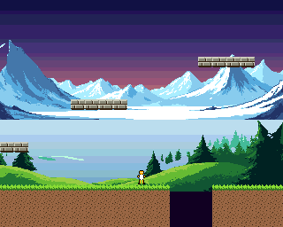

# Amiga Game Kit (AGK)

A kit for building Commodore Amiga games with AI coding agents (Claude Code,
Codex, Cursor, ...). Agents are only as good as their feedback loop, so AGK
gives them a **deterministic, headless build → run → observe → test** cycle:
screenshots, frame-exact joystick input, serial debug output, memory and
register dumps, and golden-image tests. It's built on proven Amiga tooling:
[ACE](https://github.com/AmigaPorts/ACE), bebbo's GCC and
[vAmiga](https://github.com/dirkwhoffmann/vAmiga).

```
$ agk test examples/hello
PASS boot [a500] 0.3s, boot 1.5s (cached next time)
PASS clamp [a500] 0.8s
PASS move [a500] 0.4s
...
9/9 passed
```

## Example: `examples/sidescroller`



A dual-playfield parallax platformer, built by an AI agent with the kit:
- The mountains and hills are AI-generated with `agk art-gen` (Retro Diffusion, about $0.08 in total).
- They scroll at ¼ and ½ speed behind the level, over a copper sky gradient.
- Run, jump, platforms and pits.

It's tested pixel-exact on Kickstart 1.3, 3.1 and AROS, including a test that
proves the parallax speeds, and it runs at 50 fps using about 21% of the
frame. See its README for the register-level setup.

## Quick start

```sh
tools/setup                    # fetch pinned ACE + vAmiga, apply patches, build emulator, pull toolchain
export PATH="$PWD/tools:$PATH"
agk doctor                     # check Docker, emulator, ROMs, profiles

agk new ~/games/mygame         # start a game from the template (AGENTS.md, tests, .mcp.json included)
cd ~/games/mygame
agk unit                       # game rules compiled for the host: milliseconds
agk build                      # C + ACE -> build/mygame.adf (bootable floppy), compiled in Docker
agk test --update              # record the first golden screenshots
agk run -s "press right 20" -s "screenshot moved"   # try things; prints the PNG paths
```

Then open the project in Claude Code (or any agent). It picks up `AGENTS.md`
and the `amiga` MCP server from `.mcp.json`, whose tools return screenshots as
images.

Requirements: Docker, git, cmake, Python 3.11+, a host C compiler, and a C++20
compiler for vAmiga (on macOS: `brew install llvm`, because Apple's clang 15 is
too old).

## How a run works

1. **Boot once.** AGK powers on the emulated machine, inserts the ADF and runs
   until the game prints its ready text (`AGK ready`) on the serial port. It
   saves a snapshot on the next frame boundary. Snapshots are cached per build
   and profile, so later runs skip the floppy boot and start in about 0.3 s.
2. **Play the scenario.** Every step (`press right 20`, `wait 5`,
   `screenshot moved`, ...) is timed in video frames and lands on a frame
   boundary. The same scenario gives byte-identical results on every run,
   whether it started from the cached snapshot or from a fresh boot.
3. **Collect results.** You get PNG screenshots, the full serial log, memory
   dumps and register views in `build/agk/<profile>/<scenario>/`. `agk test`
   also compares screenshots against `tests/golden/` and writes a
   `*.diff.png` that highlights changed pixels in red.

The scenario language is documented in `agk help-scenario`.

## Games talk to the harness over serial

Games link the AGK runtime (`runtime/`) and report what they're doing through
`#include <agk/debug.h>`:

- `agkReady()` prints `AGK ready`: call it once the first real frame is on screen. The harness waits for it.
- `agkState("score", 10); agkEnd();` prints `AGK score=10`, which tests match with `expect-serial`.
- `agkDebugAsync(1)` (after `systemUnuse()`) makes output interrupt-driven, so it costs almost no frame time.

## Art pipeline

Draw graphics as text files or PNGs (hand-made, from a pixel-art tool or from
an AI generator) in `art/`:
- **`agk art`** converts them to Amiga hardware sprites and BOBs.
- It **enforces the hardware's rules**, e.g. a sprite is 16 px wide with 3 colours, sprites on a channel pair share colours, and BOB colours must be in the palette. Problems come back as clear errors or warnings.
- It writes zoomed **previews** of exactly what the Amiga will show.
- Games call generated functions (`artPlayerCreate(frame)`, …). See `agk help-art` and `techniques/sprites`.
- **`agk art-gen`** creates art with [Retro Diffusion](https://retrodiffusion.ai/) (pixel-art models, constrained to the game's palette): about $0.02 and 12 s per image. It needs your own API key in `RD_API_KEY` or `~/.config/agk/credentials`.

## Project structure

`agk new` produces a game split so agents can test it quickly:
- `src/logic.c` holds the rules in portable C and is unit-tested on the host by `agk unit`.
- `src/main.c` is the Amiga side (ACE display, sprites, blitter, joystick).
- `tests/*.agk` are emulator scenarios with golden screenshots.

## MCP server

`tools/agk-mcp` is a stdio MCP server with `agk_build`, `agk_run`, `agk_test`,
`agk_unit`, `agk_doctor` and `agk_scenario_help`. New projects already include
it in `.mcp.json`. To add it elsewhere:
`claude mcp add amiga -- /path/to/amiga-game-kit/tools/agk-mcp`.

## Profiles

| profile | machine | ROM |
|---|---|---|
| `a500` (default) | A500, OCS, 512K chip + 512K slow | Kickstart 1.3 |
| `a500-ks31` | A500, ECS, 1MB | Kickstart 3.1 |
| `a500-aros` | A500, OCS, 1MB + 2MB fast | AROS (free, no Kickstart needed) |
| `a1200` | A1200, AGA, 2MB (experimental: logic matches, AGA colour output differs slightly so it gets its own goldens) | Kickstart 3.1 |

**Kickstart ROMs are copyrighted and are never committed, bundled or downloaded
by AGK.** Put your own licensed ROMs in `roms/` (gitignored), or point
`AGK_ROMS` at another directory. Files are matched by SHA-1, so any file name
works. The `a500-aros` profile needs no Kickstart, which makes it a good fit
for CI.

## Layout

```
tools/        setup, build, selftest, agk (CLI), agk-mcp (MCP server)
harness/agk/  the agk CLI: scenarios, emulator driver, images, profiles, MCP
runtime/      C library games link (serial debug channel)
templates/    project templates for agk new
techniques/   small tested games, one technique each, with TECHNIQUE.md (bobs,
              scrolling, copper, sprites/art) - measured costs and gotchas
patches/      local patches to vAmiga and ACE (all intended for upstream)
examples/     example games; each has agk.toml, src/, tests/*.agk, tests/golden/
docs/         design notes and results
roms/         your Kickstart ROMs (gitignored)
third_party/  pinned ACE + vAmiga checkouts (gitignored, created by tools/setup)
```

## License

MIT. Third-party components keep their own licences:
- ACE: MPL-2.0.
- vAmiga core (`Core/`, including VAHeadless): MPL-2.0.
- Moira CPU core: MIT.

Only vAmiga's macOS GUI app is GPL-3.0, and we don't use it.
