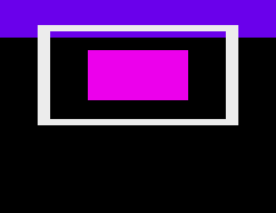
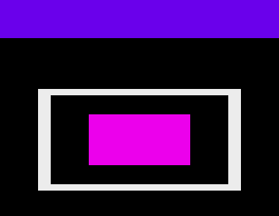

# Phase 0 spike results

**Date:** 2026-09-24 · **Host:** macOS 26 (Darwin 25.2), Apple Silicon (arm64)

**Goal:** show that an agent can go from source code to a verified screenshot
with no human involved.

**Verdict: yes.** The whole loop runs headless and is deterministic:

> C + ACE → cross-compile in Docker → bootable ADF → vAmiga headless on Kick 1.3 → scripted joystick input → screenshot + serial log → hash/assert

A typical run covers about 46 seconds of emulated time and takes **about 2.1 s
of wall-clock time**, roughly 22× real time. We are committing to
**vAmiga headless** as the emulator backend (§6).

## 1. Scaffold

The repo now has this layout:

- `tools/setup`: fetches the pinned ACE and vAmiga sources, applies our patch, builds the headless emulator and pulls the toolchain image. Running it again is safe.
- `tools/build`: builds an example into a bootable disk image.
- `harness/agk_run.py`: the test runner.
- `examples/hello`: the test game.

Licence is MIT. ROMs, the `third_party/` checkouts and all build/run outputs are gitignored.

## 2. Toolchain

- The `amigadev/crosstools:m68k-amigaos` image ships **native arm64** builds as well as amd64, so nothing runs under emulation. It contains bebbo's `m68k-amigaos-gcc 6.5.0b`, `vasm`, `cmake` and `xdftool`. It does **not** contain `vlink`, which we haven't needed yet.
- `tools/build` configures the example with the image's `m68k-amigaos.cmake` toolchain file, using `-m68000`, soft float and **`M68K_CRT=nix13`**. The default C runtime is `nix20`, which assumes Kickstart 2.0 or later, so it is the wrong choice for a Kick 1.3 target.
- It then writes an **OFS** disk image with a bootblock and `s/startup-sequence`. OFS matters because Kick 1.3 can't boot FFS floppies.
- Size: the `hello` executable is 147 KB stripped, most of it ACE. It takes about 20 s to load from emulated floppy on 1.3 (§5), so size is worth optimising later.

## 3. Hello world (`examples/hello`)

What it does:

- takes over the OS via ACE
- shows six copper colour bars, created by rewriting COLOR00 per band
- displays a 16×16 hardware sprite (channel 0) that the joystick moves
- sends debug text to the serial port with a tiny routine (`dbg.c`) that polls SERDAT directly, so it doesn't need the OS or an ACE debug build

Every 25 frames it prints a machine-readable status line such as `AGK frame=… x=… y=…`.

A compiler warning (`-Wincompatible-pointer-types`) caught a real bug during development: ACE's `Planes[]` is a byte pointer, so the row offset had to be cast to word units. It's an early example of why the kit's lint and warning settings matter for agents.

## 4. Emulator: vAmiga headless (`VAHeadless`, v5.0b2)

- **Build:** `Core/CMakeLists.txt` builds a standalone `VAHeadless` binary. Apple's Command Line Tools clang 15 **can't compile it** because of a libc++ C++20 template error. Homebrew LLVM (`brew install llvm`, clang 23) builds it cleanly.
- **Scripting:** RetroShell scripts use these commands:
  - `regression setup <scheme> <rom> [ext]`
  - `serial set DEVICE RETROSHELL`
  - `regression run <adf>`
  - `wait N seconds`
  - `joystickN pull/release/press`
  - `screenshot save <name>`
- **Quirks we hit:**
  - `wait` requires a unit (`wait 12` fails; `wait 12 seconds` works).
  - Every `wait` prints a harmless `std::exception` line, because the pause is implemented as an exception that the verbose console echoes.
  - `screenshot save` writes `/tmp/<name>.raw` (716×285 packed RGB) and then **quits the emulator**, so each run gives exactly one screenshot.
  - Serial output arrives one character per line, as `T: <c>` or `T: [hh]`. `agk_run.py` decodes it.

## 5. The key unknowns

| Question | Result |
|---|---|
| Boots on Kick 1.3 headless? | ✅ About 20 s of emulated time from power-on to the game running (floppy load). |
| **Screenshots byte-identical across runs?** | ✅ 5/5 sequential runs gave an identical frame hash (`fbb629b7…`) and identical serial logs. 4 parallel runs were also identical, so CI can run tests concurrently. |
| **Joystick input moves the sprite?** | ✅ `joystick2 pull right`, then `release x` moved it from x=152 to 304 (clamped at the edge), and `pull down` moved it down. Confirmed in both the serial log and the screenshot. |
| **Serial output reaches stdout?** | ✅ Our SERDAT writes at 115200 baud come through intact. |
| **Can we step to an exact frame?** | ⚠️→✅ Not in stock vAmiga, where `wait` only takes whole seconds. We **patched** it (35 lines, `harness/patches/vamiga-wait-frames.patch`) to accept `wait N frames`, which wakes exactly on a frame boundary. Holding right for N frames now moves the sprite exactly 2N pixels for N = 1, 10, 11, 37 and 50. Without the boundary alignment, an 11-frame hold covered 12 input samples. |
| Boots on Kick 3.1 (r40.63)? | ✅ It also boots faster than 1.3. |
| **Boots on AROS?** | ✅ With a condition: AROS (the 2026-08-20 build bundled in vAmiga's sources) **hangs after `romtaginit` on a 1 MB machine** and needs **fast RAM** (`mem set FAST_RAM 2048`). Chipset doesn't matter; OCS works. Its output is **pixel-identical** to Kick 3.1. |

Evidence: the joystick run and the per-frame input log.

### Unexpected finding: Kick 1.3 reports NTSC under vAmiga

On Kick 1.3 the sprite was drawn **10 lines higher** relative to the copper
bars than on 3.1 or AROS.

| Kick 1.3 | Kick 3.1 / AROS |
|---|---|
|  |  |

We diagnosed it through the serial channel:

- Kick 1.3 reports `SysBase->VBlankFrequency=60` and a clear `GfxBase->DisplayFlags & PAL`.
- Kick 3.1 and AROS report 50 Hz and PAL.
- ACE's `systemIsPal()` trusts `VBlankFrequency`, so on 1.3 it picks the NTSC display-window offset (`0x22`) instead of the PAL one (`0x2C`). That is exactly the 10-line difference.
- It happens with the OCS and ECS schemes alike, and forcing `VIDEO_FORMAT PAL` doesn't change it.

**Not yet known:** whether this is a vAmiga emulation gap (for example, how Kick 1.3 is told it's PAL) or expected 1.3 behaviour that ACE should work around, e.g. by reading Agnus ID bits or assuming PAL for an A500 target. Real PAL A500s run 1.3 games correctly, so something in this stack is off.

**Next steps:**
1. Check the 1.3 PAL detection path in the ROM and compare it with vAmiga.
2. Raise the issue with vAmiga or ACE.
3. Until then, a game that targets PAL can pass `TAG_VIEW_WINDOW_START_Y`.

This is exactly the kind of bug the ROM test matrix exists to catch, and the serial debug channel found the cause in two runs.

## 6. Decision: vAmiga headless is the harness backend

Why:
- It is deterministic.
- It runs about 22× real time.
- It builds natively on macOS.
- Scripted input works.
- Serial capture works.
- It has good register and memory debugger commands (not yet exercised).
- It can boot a real Kickstart or AROS.
- The core is MPL-2.0, so it's licence-compatible even if we link it later.

**We don't need Copperline or Amiberry as a fallback.** The gaps are small and can be fixed upstream:

| Gap | Plan |
|---|---|
| One screenshot per run (`screenshot save` quits) | Patch in a "save without quitting" variant, or drive the RPC server for interactive sessions. |
| No frame stepping in stock vAmiga | Our `wait N frames` patch. Offer it upstream. |
| `/tmp`-only screenshots (`RegressionTester` requires `/tmp`) | OK on macOS and Linux. Revisit for Windows. |
| Emulates OCS/ECS; the smoke tests list an `A1200_2MB` AGA scheme | Evaluate for the `a1200` profile later. |
| Needs Homebrew LLVM on macOS | Document it, or build the emulator in Docker for CI. |

## 7. What's next (Phase 1)

1. Turn `agk_run.py` into the `agk` CLI:
   - multiple screenshots per run
   - input scripts as files
   - golden-image assertions
   - serial `expect` rules
   - memory and custom-register dumps via the debugger commands
2. Build a thin MCP server on top of the CLI.
3. Resolve the Kick 1.3 PAL question.
4. Offer the `wait N frames` patch to vAmiga upstream.
5. Build the emulator in Docker so CI runs on Linux.
6. Write the first agent test tasks against `examples/hello`.
