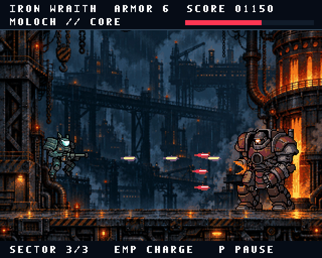

# IRON WRAITH

A playable A1200 / AGA mech-assault demo: breach a burning weapons foundry,
fight two drone waves, and destroy MOLOCH, a huge walking reactor.



[Watch the complete demo with sound](demo/ironwraith.mp4).

## Play

From the kit root:

```sh
tools/agk play examples/ironwraith
```

Or boot `build/ironwraith.adf` on an A1200 configuration with 2 MB chip RAM
and your own Kickstart 3.1 ROM. Build it with `tools/agk build examples/ironwraith`.
The ADF contains the complete game; it needs no loose asset files.

| Control | Action |
|---|---|
| Arrow keys / joystick | Fly the mech |
| Space / Fire | Deploy, hold to fire, redeploy after victory or defeat |
| X / second fire button | EMP: destroy drones, cancel bullets, damage MOLOCH |
| P | Pause / resume |
| M | Music on / off |
| Esc | Exit |

Keep moving vertically, hold fire, and save EMP for crowded moments. Green repair
cells restore two armor points. EMP recharges in six seconds. The boss arrives
after 18 seconds and grants two armor points for the final fight. Damage feedback
uses explosions and a red HUD edge; the player never disappears while invulnerable.

## What runs on the Amiga

- 320×256, eight bitplanes, 256-entry 24-bit AGA palette, 64-bit bitplane fetches.
- 176 background colors, 16 reserved sprite slots, 64 combat/UI palette entries.
- A 48×48, 15-color mech using six attached hardware sprite channels; separate
  sprite data for each display buffer prevents visible control-word writes.
- An 80×80 boss with 18 poses: grounded stride, cannon wind-up, muzzle flash,
  recoil, damage reaction and a timed reactor destruction. Drones, bullets and
  explosions are also drawn by the blitter. Pristine
  background restoration and blitter priority keep the busiest scenes on budget.
- Double buffering, a 50 Hz game loop, a 58-second sampled industrial-metal track and a dedicated
  Paula effects voice. Title/result lettering is prepared before gameplay.
- Portable deterministic rules, health, repairs, EMP cooldown, pause, victory,
  game over, restart and a session best score.

The A1200 profile is experimental. This demo is verified in the kit's emulator;
real A1200 hardware has not been tested. See [AGA setup and limitations](../../docs/aga.md).

## Art

The foundry uses generated source artwork, compiled to the hardware palette.
Retro Diffusion provided the selected armored mech, boss, and idle poses after
comparison with the native hand-built candidates. The total successful RD charge
was **$1.28**, including three new boss animation sheets. Original sources, alternatives, exact prompts and costs are retained
in [art/source/PROVENANCE.md](art/source/PROVENANCE.md).

The soundtrack uses original synthesized power-chord guitars, grit bass and
layered drums, with a quiet breakdown and phrase-ending fills. Regenerate its
eight instruments with `python3 sound/tools/make_samples.py`; the fourth Paula
voice remains available for combat effects.

The authoring-only script `python3 art/tools/build_art.py` requires Pillow. Normal
`agk build` uses the checked-in PNGs and needs no Python packages.

## Verification

```sh
tools/agk unit examples/ironwraith
tools/agk test examples/ironwraith
tools/agk run examples/ironwraith -f examples/ironwraith/tests/mission.agk --fresh
```

Tests cover deployment, movement, damage, EMP, pause, death/restart and a complete
winning mission. `boot.agk` checks exact RGB24 values, including upper palette
banks. Every scenario guards dropped frames and maximum load. `mission.agk` is a
reproducible controller route through the ordinary game, with no invulnerability
or test-only gameplay shortcuts.
