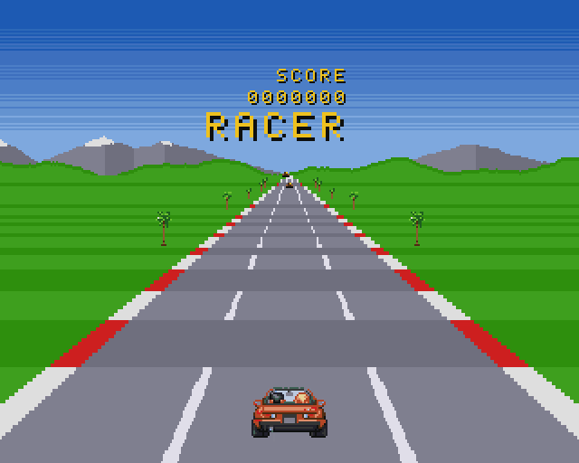

# racer: a raster-road racer in the arcade style (A500, OCS, PAL)

[](../../docs/media/racer.mp4)

▶ [Watch it with sound](../../docs/media/racer.mp4): 36 s, recorded from the
emulator with `agk record demo/showcase.agk` (the GIF is silent).

Drive a sports car down a coast road: hills and curves, a horizon of snowy
mountains, 32 rival cars in three lanes, and a clock. The roadside has palms,
bushes, chevron signs warning of each bend, and pillars at the checkpoints.
Run into one at speed and the car tumbles through the air and is put back on
the road standing; slower, it just stops against it. Each
checkpoint (every 100 segments, four per lap) adds 25 seconds. When the clock
runs out it's TIME UP, then back to the title. It runs at 25 fps on a
stock A500 (7 MHz 68000, 512 KB chip + 512 KB slow RAM), with an original
tune, an engine note that follows the speed, and sound effects.

Controls (joystick in port 2): up or fire to accelerate, down to brake,
left/right to steer. Fire starts a race on the title. Esc quits.

All art and sound are original. The player's car and the palm are AI
pixel art (Retro Diffusion, `art/ai/`). The rival is that car repainted
(`art/tools/rival.py`), and the car's tumble frames are it rotated and flipped
(`art/tools/car_crash.py`). The bush, the signs and the pillar are drawn by
`art/tools/props.py`. The mountains are drawn by `art/tools/backdrop.py`,
the HUD font is typed in `art/tools/font.py`, and the music is MML
(`sound/theme.mml`).

## Display

OCS dual playfield, 6 lowres planes, built from a raw copper list:

```
 y   0 ┌──────────────────────────────┐  sky: COLOR00 per line, bitplanes OFF
     │                               │  (no bitplane DMA here: the CPU runs faster)
  36 ├──────────────────────────────┤  bitplanes on: PF1 = HUD, objects (3 planes,
     │  TIME   SCORE   SPEED         │  double-buffered), PF2 = the road (3 planes)
  39 ├──────────────────────────────┤  a copper block per line from here down:
     │  horizon strip (32 lines)     │    WAIT line, BPLCON1 (PF2 scroll),
     │  road rows, far → near        │    BPL2MOD (which road row the next line
     │                               │    shows), COLOR00 (grass stripe)
 212 │           [car]               │  the player's car: 6 attached sprites
 255 └──────────────────────────────┘
```

- **PF2 is a road bitmap**, 1024 px wide, with one row per distance:
  - It holds 80 projected rows, each drawn twice (light and dark stripe colours), plus the 32-row horizon strip.
  - Nothing is drawn per picture. The copper picks a row and a horizontal scroll for every line through each line's BPL2MOD and BPLCON1.
  - Hills make rows repeat or hide behind crests. Curves and steering shift the scroll.
- **PF1 holds the roadside objects and the HUD.** The objects (palms, bushes, signs, pillars, rivals) come in 10 pre-scaled sizes (`art/tools/scale_sheet.py`). The blitter cookie-cuts them in, and erases each one the picture after next.
- **The sky above line 36 has no bitplanes.** The copper turns the planes off there and on again at line 36, which gives the CPU 5% more time.

## How a picture is made (`src/main.c`, `src/logic.c`)

1. **Logic, two frames at 50 Hz** (`logicUpdate`): driving, the rivals, collisions, the clock and checkpoints. It's plain C with no Amiga headers, so `agk unit` tests it on the host.
2. **Projection** (`logicRoadRuns`): for 80 rows, far to near, it works out the screen line, the centre and the stripe. The output is runs of lines that show the same row.
   - Within a track segment the road is a straight line in 3D, so a row's line is linear in its row number. Two MULS per segment, then only additions per row.
   - Everything is 16.16 fixed point: the integer part is a SWAP away.
3. **Objects** (`logicObjects`, `objectsQueue`):
   - The palms (by segment) and the rivals (by distance) are sorted by depth. The nearest 14 are queued as blits: erase last time's, then draw, farthest first.
4. **Copper loop:** the runs become per-line BPLCON1 and BPL2MOD values in the back copper list. Between runs the CPU feeds the queued blits to the blitter (polled, not interrupt-driven), so both work at once.
5. **HUD:** the CPU copies the changed letters into PF1. Big digits are the small font with its pixels doubled.
6. **Sound:** effects start on game events. The engine is Paula channel 2, driven directly (see below).
7. Wait for the blits, swap the copper lists, and start the next picture two vertical blanks after this one.

## Sound

`sound/sound.toml` + `sound/theme.mml`, converted by `agk sound`:

- **Music:** "Coast Road", 16 bars in D major at 150 BPM (a 26 s loop). Lead, a syncopated bass and drums on Paula channels 0, 1 and 3.
- **Effects** take channel 3 for a moment: crash (a long crunch), bump (a short one), checkpoint (a rising arpeggio), start, time up (a long fall), grass (a rumble).
- **The engine** is channel 2, which ptplayer is told to leave alone:
  - A 64-sample waveform in chip RAM, looping.
  - Its period follows the speed through two gears, so the note drops at the shift. It's louder on the throttle.
  - The waveform has zero mean. With a DC offset, every volume change thumps.

## Frame budget on a 7 MHz 68000

The perf scenario (`tests/perf.agk`) averages about **74% of the two-frame budget**, peaks at 88%, and drops no frames. Rough cost per picture, in raster lines (626 per picture):

| work | lines |
|---|---|
| projection (80 rows) | ~145 |
| copper loop (217 line blocks) | ~155 |
| objects: sort, queue, blits | ~100 |
| logic (2 frames, 32 rivals) | ~30 |
| HUD | ~15 |

The palms, traffic, HUD and sound each pushed the budget over, and each was paid for by one of these:

- **GCC 6.5 calls a library routine for 32-bit multiplies** (`___mulsi3`), often where you don't expect one:
  - A loop's end pointer (`p -= n` after a counted loop).
  - A negation folded into a constant (`-(x * 64)` became a multiply by -64).
  - `a * b / c` in 32 bits.
  
  The fixes are inline MULS.W/DIVU.W helpers, stop pointers computed with a shift behind `__asm__("" : "+d"(x))`, and negating first. Check the disassembly after changes: `objdump -dr` and grep for `___`.
- **Everything runs about 2.3× slower than its cycle count.** On an A500 the code and data sit in slow RAM, which shares the bus with six planes of display DMA and the blitter. Fewer instructions, fewer memory accesses and fewer spilled registers are what count. Keeping the projection's loop state in registers saved 5%.
- **Merging work helps more than tuning it.** The horizon strip was 32 one-line runs; it's now one run whose modulo steps a row per line (−3%). A pointer that steps between line blocks replaced a table of pointers.
- **Serial output isn't free:** every character is an interrupt. The state line prints on events and every 32 frames, not every 5 pictures.
- **Pace pictures on the blank counter, not the beam.** Waiting for the display's end missed it by a whole frame whenever the music's timer interrupt landed just then.
- **Blit queue:**
  - Feeding it from the blitter's interrupt raced with the final wait (two blits at once gave garbage), so it's polled.
  - A start-up call queued a picture's blits twice and ran off the end of the queue into the blit templates.

## Tests

`agk test` runs these on Kickstart 1.3, 3.1 and AROS:

| scenario | checks |
|---|---|
| `boot` | the title screen: sky, grass, the horizon strip, the road |
| `mouse` | the mouse in port 1 doesn't steer |
| `traffic` | full speed into the rival ahead: a bump (and its sound), bounce, overtake |
| `crash` | full speed into the palms: a crash (and its sound), the tumble, back on the road |
| `flow` | title → race → the clock runs out → TIME UP → title, with sounds |
| `perf` | hills and curves at full speed: no dropped frames, ≤ 90% of the budget |

`agk unit` covers the rules on the host:
- road rows and stripes
- hills hiding the road and objects behind crests
- curves, steering, grass, the lap
- rivals: they drive, a rear-end slows you, other lanes pass
- crashes: into an object at speed, slowly into one, and a lap along the grass that misses them all
- the clock, checkpoints and the title

The demo (`demo/showcase.agk`) was generated by a host-side autopilot that plays by `logic.c`'s rules. It changes lanes only when a rival is close, and reaches the first checkpoint without a bump.

## Files

| path | what |
|---|---|
| `src/logic.c`, `src/logic.h` | rules, projection, objects, traffic, clock (host-testable) |
| `src/main.c` | display, copper lists, blit queue, HUD, sound, main loop |
| `src/gen_*.h` | generated tables (object sizes, font) |
| `art/tools/` | generators: props, rival, car crash frames, font, backdrop, size sheets |
| `art/` | art sources, `art.toml` (agk art pipeline), `tools/` generators |
| `sound/` | effects and music (agk sound) |
| `tests/` | scenarios, goldens, `unit/test_logic.c` |
| `demo/showcase.agk` | the video's scenario |
