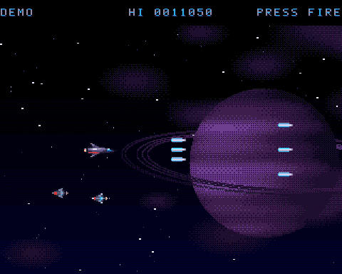

# VOIDRUNNER: a horizontal shoot-'em-up (A500, OCS, PAL, 50 fps)

[](../../docs/media/voidrunner.mp4)

▶ [Watch level 1 with sound](../../docs/media/voidrunner.mp4): 104 s of the
game playing itself (its attract mode), recorded with `agk record demo/showcase.agk`.

Level 1, **Outer Belt**: fly the VR-1 fighter through a scripted run of
enemy waves in an asteroid belt, past a ringed gas giant, to the Warden, a
battleship guarding the belt. Every sprite, object, the backdrop, the logo
and the font were made for this game, by hand as text art or by the drawing
code in `art/tools/draw.py`. No AI image generation, and no assets from
anywhere else.

Controls (joystick in port 2): move in 8 directions, hold fire to shoot.
Fire starts a game. Left on the title for 10 s, the game plays itself (a
demo in which the ship can't be hit), and fire ends it. Esc quits.

## The level

About 75 s of waves, then the boss, driven by a timed script (`s_pScript` in `src/logic.c`):

| enemy | behaviour | hits | points |
|---|---|---|---|
| dart | formations of 5 on a sine wave; shoot all 5 for a **weapon capsule** | 1 | 100 |
| mine | glides in, stops, fires at you, leaves | 3 | 300 |
| asteroid | drifts, tumbles; breaks into two pebbles | 4 | 200 |
| pebble | drifts | 1 | 50 |
| gunship | hovers, fires three ways | 8 | 500 |
| **the Warden** | sweeps up and down; fans from its turrets, aimed bursts and rings from its core. Only the core can be hurt: shots level with it get past the armour | 90 | 10000 + 2000 per ship left |

- **Guns:** single, double, then a spread of three. Capsules raise it, and dying lowers it by one.
- **Ships:** three. After a death you're back in 2 s, invulnerable (blinking) for 2 s.
- **Ending:** STAGE CLEAR after the Warden, GAME OVER after the last ship; both go back to the title, which keeps the high score.

## How it's drawn

OCS dual playfield, 5 bitplanes, at 50 frames a second:

```
 y   0 ┌──────────────────────────────┐  PF1 = the HUD bitmap (score, high score, ships, gun)
  24 ├──────────────────────────────┤  the copper switches PF1 to the frame buffer
     │  PF1: enemies, shots,         │     (double-buffered, blitter objects)
     │       explosions, messages    │  PF2: the backdrop - gas giant, moon, nebula -
     │  PF2: the backdrop, drifting  │     2 planes, scrolled a quarter pixel a frame
     │  sprites 0-3: your ship       │  sprites 0-3: the VR-1, 32 px, 15 colours
     │  sprite 6: the stars          │  sprite 6: a star per line, set by the copper
 255 └──────────────────────────────┘  COLOR00: a navy gradient, per line
```

- **The starfield** is one hardware sprite, re-used on every line:
  - The copper sets its position and data at the start of each line, so the CPU writes nothing per star.
  - Stars move a whole layer at a time: one byte decrement per star per step. Near stars move 2 px a frame, mid ones 1 px, far ones ½ px.
  - Sprites 6–7 sit behind both playfields, so the planet hides the stars behind it.
- **The ship** is four attached sprites (two 16 px columns, 15 colours). Its last three colours are the starfield's three, because they share hardware registers. The text art lists colours in register order, which is what makes that work (see the kit note below).
- **Everything else** is the blitter:
  - A queue: this buffer's erasures start first thing in the frame, then each object is queued and the blitter is kept fed.
  - The 3 planes are interleaved, so one blit covers all of them.
  - Most objects are cookie-cut. Shots and bullets are plain copies at half the cost.
  - The Warden (96×64) is copied from an image with a blank border, which wipes where it has just been, so it needs no erase blit.
- **The HUD** has its own bitmap; the copper switches PF1 to the game at line 24, so objects never erase the score.

Everything the display reads is double-buffered: the frame buffers, the HUD, the star copper lists, and the ship's sprite data. So a picture never depends on how fast the CPU got somewhere, and Kickstart 1.3, 3.1 and AROS give pixel-identical results.

## Sound

`sound/sound.toml` and `sound/theme.mml`, converted by `agk sound`:

- **Music:** "Outer Belt", 16 bars in E minor at 150 BPM (a 26 s loop), a ProTracker MOD with synthesized samples (`sound/tools/make_samples.py`):
  - A lead, a pulsing bass and drums.
  - Plucked arpeggios on the channel the effects borrow: the shots fire all the time, and losing the arpeggios is the least noticeable.
- **Effects:** shot, hit, pop, boom, power-up, the ship exploding, the boss's core being hit, and the WARNING alarm.

## Frame budget

The demo is the worst case: the spread gun, every wave, the Warden's death, the music. It averages 50–80% of a frame, peaks around 100%, and drops no frames (`tests/perf.agk`). What it took to get there:

- **One shared bus:** on an A500 the CPU runs from slow RAM, on the same bus as the display and the blitter. While the blitter works, the CPU crawls, so less blitting means more CPU as well.
  - Plain copies for shots and bullets.
  - The Warden copied with a blank border instead of cookie-cut plus erase.
  - Fewer big explosions when it dies.
  - The blitter gets priority (BLTPRI) while the CPU only waits for it at the end of a frame.
- **Collisions:** the live targets' boxes are built once a frame, so a shot is four compares per target. Before, it was a size lookup and a multiply for every shot and every enemy.
- **No library calls per frame:** `%` and `/` by constants and 32-bit `int` maths call GCC library routines. They use MULS/DIVS/DIVU helpers instead.
- **Two starfield bugs:**
  - At first each line's position word used the line number as the sprite's vertical start. That woke the sprite's DMA, which fetched garbage over the copper's data: dashes instead of stars, different on every Kickstart. The vertical start is now 0.
  - The Warden's sweep read the sine table once every 4 frames. It moved in 6 px jumps, more than its image's blank border, and left a trail. It now interpolates and glides.

## Tests

`agk test` runs these on Kickstart 1.3, 3.1 and AROS:

| scenario | checks |
|---|---|
| `boot` | the title |
| `start` | fire starts a game: STAGE 1 - OUTER BELT, then the first formation shot down |
| `death` | into the first formation without firing: the ship explodes, a ship is lost, it's back |
| `demo` | the attract mode plays the whole level: the Warden, then STAGE CLEAR (with its sounds) |
| `perf` | the same, with no dropped frames and at most 100% of a frame |
| `mouse` | the mouse doesn't move the ship |

`agk unit` covers the rules on the host:
- the title and the start
- movement, the three guns
- kills, the formation's capsule, asteroids breaking
- death and respawn, game over
- the whole level played by a bot that can't die (the Warden beaten at ~85 s)
- the demo

## Files

| path | what |
|---|---|
| `src/logic.c`, `src/logic.h` | the rules, the level script, the demo's pilot (host-testable) |
| `src/main.c` | display, copper lists, starfield, blit queue, HUD, sprites, sound |
| `art/*.txt` | the sprites and objects as text art (`agk help-art`) |
| `art/tools/draw.py` | draws the asteroids, mine, explosions, the Warden, the backdrop, the logo and messages |
| `art/tools/font.py` | the HUD font |
| `sound/` | effects, the tune, `tools/make_samples.py` |
| `tests/` | scenarios, goldens, `unit/test_logic.c` |
| `demo/showcase.agk` | the video's scenario |
